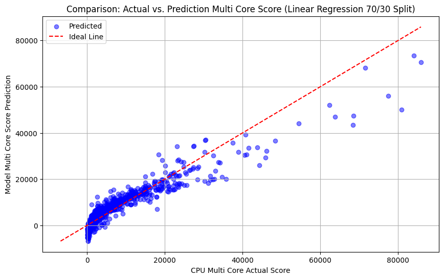
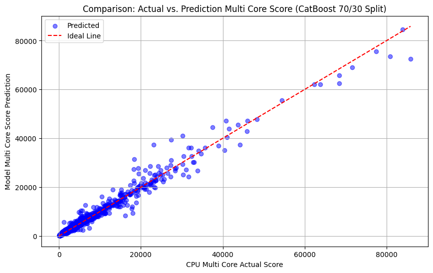
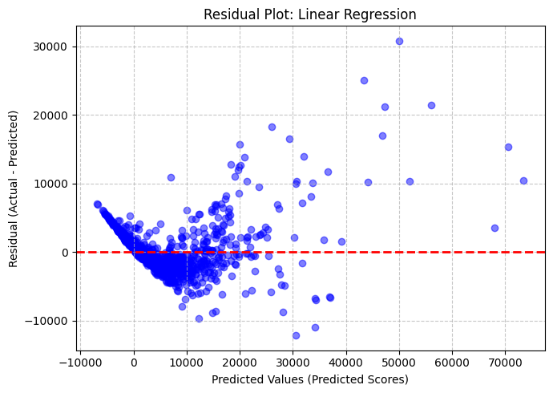
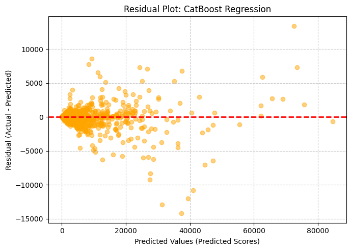
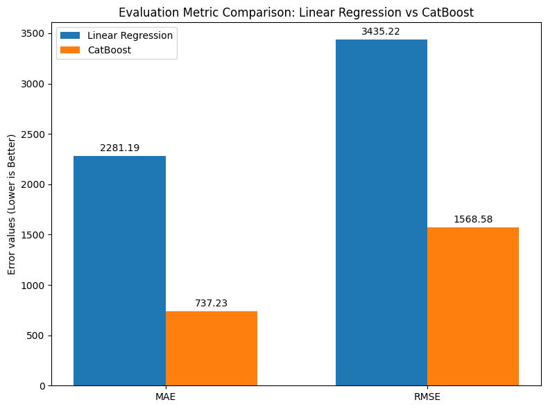
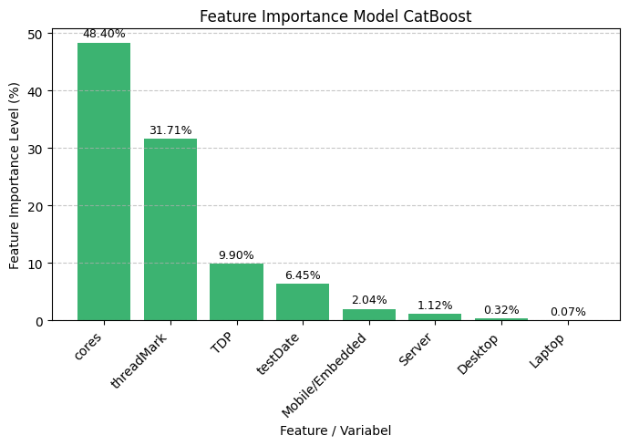
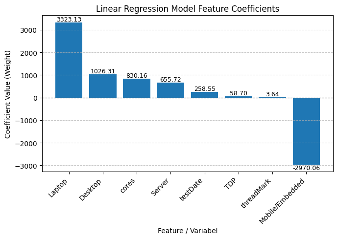

# CPU Multi-Core Score Prediction — Linear Regression vs CatBoost

A regression project predicting CPU multi-core benchmark scores (`cpuMark`) from
hardware specifications, comparing a linear baseline against a gradient-boosted
tree model. Originally developed as a university mid test assignment, this repository
has been substantially reworked to reflect a portfolio-level analysis process:
identifying data leakage, diagnosing model-specific failure modes, and
validating findings across multiple independent methods.

## Dataset

- **Source**: [CPU Benchmark dataset](https://www.kaggle.com/datasets/alanjo/cpu-benchmarks) (PassMark-style
  benchmark data), covering CPUs released between 2007–2022.
- **Target**: `cpuMark` — multi-core benchmark score.
- **Size**: 3,825 rows, 12 original columns.

## Project Structure

```
notebooks/
  multicore_score_prediction.ipynb        # Preprocessing, training, evaluation, visualization, CV
datasets/
  raw/                     # Original CSV
  processed/               # Cleaned CSV used for modeling
images/
  actual_vs_predicted_linear.png
  actual_vs_predicted_catboost.png
  residual_linear.png
  residual_catboost.png
  evaluation_metric.png
  feature_importance_catboost.png
  linear_feature_coefficients.png
```

## Key Methodology Decisions

### 1. Feature Removal — Leakage and Comparability

Five columns were dropped before modeling, each for a distinct reason:

| Column | Reason |
|---|---|
| `price` | Dataset spans 2007–2022; comparing raw prices across 15 years without inflation/technology adjustment introduces unjustifiable skew. ~49% NaN. |
| `powerPerf` | **Confirmed data leakage.** Verified manually that `powerPerf = cpuMark / TDP` exactly (e.g. row 0: 108822/280 = 388.65, matching the stored value). Retaining this column would let the model reconstruct the target almost directly. |
| `cpuValue`, `threadValue` | Likely derived score/price ratios, dropped for the same reasoning as `price`. |
| `socket` | High-cardinality categorical name field with substantial missingness; low expected predictive value relative to its complexity cost. |
| `cpuName` | Identifier string, not a predictive feature. |

### 2. Split-Then-Fit Discipline

All data-dependent statistics (e.g. median imputation for `TDP`) are computed
from the **training set only** and applied to the test set — not computed from
the full dataset before splitting. This avoids subtle information leakage from
test data into the training process.

### 3. Categorical Encoding and the Dummy Variable Trap

The `category` column (e.g. `Desktop`, `Laptop`, `Server`, `Mobile/Embedded`)
was multi-label one-hot encoded via `get_dummies(sep=',')`. An initial pass
included all resulting dummy columns, which produced a classic **dummy
variable trap**: Variance Inflation Factor (VIF) analysis showed `testDate` at
an extreme 63.5, with category dummies also elevated (13–19). After dropping
one reference category (`Unknown`), VIF dropped substantially (`testDate`:
63.5 → 25.4; category dummies: 7–9). The residual elevation in `testDate` VIF
is treated as a **genuine data property** rather than a remaining bug — CPU
category composition has shifted over time (e.g. `Server` CPUs becoming more
common in later years), so some correlation between release date and category
is expected.

## Modeling Approach

Two models were trained **without hyperparameter tuning** by design, to
isolate the performance gap attributable to model architecture alone (linear
vs. tree-based), rather than to tuning effort:

- **Linear Regression** — baseline. Assumes an additive, linear relationship
  between features and target.
- **CatBoost Regressor** — gradient-boosted trees, chosen for native handling
  of non-linear feature interactions and general robustness with minimal
  configuration.

A `train_and_evaluate()` utility function standardizes training, prediction,
and metric computation across all model variants to keep the pipeline DRY and
reproducible.

## Results

### Single Split (70/30)

| Model | MAE | RMSE | MAPE | R² | Training Time (s) |
|---|---|---|---|---|---|
| Linear Regression | 2,281.19 | 3,435.22 | 2.0053 (200%) | 0.8772 | 0.0020 |
| **CatBoost** | **737.23** | **1,568.58** | **0.2054 (20.5%)** | **0.9744** | 1.0528 |
| Linear Regression + Log-transform | 3,542.41 | 19,545.81 | 0.3816 (38%) | -2.9761 | 0.0040 |

CatBoost outperforms Linear Regression across every metric:

- **MAE**: 737.23 vs. 2,281.19 — a **67.7% reduction**, meaning Linear
  Regression's average error is roughly 3.1x larger than CatBoost's.
- **RMSE**: 1,568.58 vs. 3,435.22 — a **54.3% reduction**.
- The proportionally larger gap in RMSE compared to MAE suggests Linear
  Regression's errors aren't just larger on average, but include more
  severe outliers — consistent with the underprediction observed on
  high-end CPUs (see Visualizations below).

### 5-Fold Cross-Validation (shuffled)

| Model | Mean R² | Std R² |
|---|---|---|
| Linear Regression | 0.8581 | 0.0331 |
| **CatBoost** | **0.9644** | **0.0154** |
| Linear Regression + Log-transform | -5.5847 | 6.5160 |

CV confirms the single-split results are stable for Linear Regression and
CatBoost (mean scores closely match the 70/30 split, with low variance).
Linear Regression + Log-transform remains unstable across folds — discussed
below.

## Visualizations

**Actual vs. Predicted (70/30 split)**

| Linear Regression | CatBoost |
|---|---|
|  |  |

**Residual Plots**

| Linear Regression | CatBoost |
|---|---|
|  |  |

**Evaluation Metrics Comparison**



**CatBoost Feature Importance**



**Linear Regression Feature Coefficients**



## Why Linear Regression Struggles: Three Converging Diagnostics

The target (`cpuMark`) is heavily right-skewed (median ≈ 2,331, max ≈
108,822), and Linear Regression's additive structure cannot represent the
multiplicative relationship between `cores` and `threadMark` that drives
actual multi-core performance, nor the diminishing-returns pattern typical of
CPU scaling. This shows up independently in three separate analyses:

1. **Actual vs. Predicted plot**: shows a crescent-shaped deviation from the
   ideal `y=x` line — the model increasingly underpredicts as actual scores
   climb, consistent with an additive model failing to capture
   diminishing-returns behavior.
2. **Residual plot**: shows a systematic curved pattern (not random scatter
   around zero) — residuals swing from positive at unrealistically low (even
   negative) predicted values, tighten near zero for mid-range CPUs, then
   swing sharply positive again for high-end CPUs. This is a textbook
   diagnostic signature of an underlying non-linear relationship that a
   linear model cannot capture.
3. **Feature coefficients**: raw (non-standardized) coefficients for
   category dummies are unusually large (Laptop: +3,323, Mobile/Embedded:
   -2,970) and are attributed to **residual multicollinearity** (VIF for
   `testDate` and category dummies remain moderately elevated) rather than
   genuine, stable effect sizes — a further symptom that the model is
   struggling to attribute credit for variance across correlated predictors.

CatBoost's residual plot, by contrast, shows only mild heteroscedasticity
(naturally scaling error at larger magnitudes) with no systematic directional
bias — a materially healthier error profile.

## The Log-Transform Experiment: A Cautionary Result

To test whether log-transforming the target could address the skew problem,
`TransformedTargetRegressor` (`func=np.log1p`, `inverse_func=np.expm1`) was
applied to Linear Regression. The result was a genuine trade-off, not a
straightforward improvement or failure:

- **MAPE improved substantially** (200% → 38%), confirming the transform
  helped narrow the *relative* error gap between low- and high-scoring CPUs.
- **RMSE and R² collapsed** (R² = -2.98 on the single split, -5.58 ± 6.52
  across CV folds), because Linear Regression is unbounded and can
  extrapolate to values far outside the training range in log-space. Once
  inverse-transformed via `expm1`, small log-space errors become
  exponentially amplified. Confirmed empirically: the model's top five
  predictions ranged from ~170,527 to ~566,738, while the actual maximum
  `cpuMark` in the test set was only 85,861 — over 6x the highest real value.

**Takeaway**: log-transforming a skewed target is not a universally safe fix
when paired with an unbounded linear model — it improves typical-case
relative accuracy but can introduce severe instability at the extremes. This
result reinforces, rather than undermines, the case for CatBoost as the more
appropriate model for this dataset.

## Feature Importance (CatBoost)

| Feature | Importance |
|---|---|
| `cores` | 48.40% |
| `threadMark` | 31.71% |
| `TDP` | 9.90% |
| `testDate` | 6.45% |
| Device categories (Desktop/Laptop/Server/Mobile) | <3.55% combined |

`cores` and `threadMark` dominate (~80% combined), consistent with their
role as the two most direct multiplicative drivers of multi-core performance
(worker count × per-worker speed). `TDP`'s moderate contribution aligns with
its role as a power-constraint penalty (e.g. a 15W 4-core CPU is expected to
underperform a 65W 4-core CPU). `testDate`'s low importance despite elevated
VIF is consistent with multicollinearity — its predictive signal largely
overlaps with `cores`, `threadMark`, and `TDP`, since modern CPUs tend to have
proportionally better specifications. Low importance across device categories
indicates raw specifications are largely sufficient to predict performance
regardless of device class — though this also means the model has no
mechanism to represent an entirely new category unseen during training, due
to the fixed vocabulary of one-hot encoding.

## Known Limitations

- No hyperparameter tuning was performed for either model, by design (see
  Modeling Approach above) — results reflect architectural differences, not
  fully optimized model performance.
- Linear Regression coefficient magnitudes for category features should not
  be over-interpreted as precise, stable effect sizes due to residual
  multicollinearity.
- The one-hot encoded category features use a fixed vocabulary determined at
  training time; the model cannot represent device categories not present
  in this dataset.
- Log-transformed Linear Regression, while informative as a diagnostic
  experiment, is not recommended as a production approach for this dataset
  without additional safeguards (e.g. prediction clipping).

## Tech Stack

`pandas` · `numpy` · `scikit-learn` · `catboost` · `matplotlib`